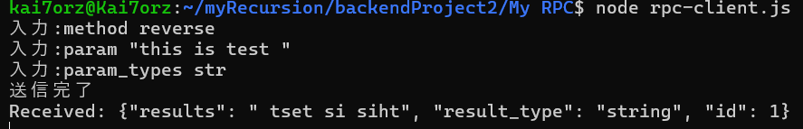

# remote-procedure-call

## 概要
node.js 側のクライアントが入力したデータを，Pythonで記述されたサーバが処理を行うJSON-RPCです.<br>
サーバは、以下の関数を RPC としてクライアントに提供します.
<br>
floor(double x): 10 進数 x を最も近い整数に切り捨て,その結果を整数で返す.<br>
nroot(int n, int x): 方程式 rn = x における、r の値を計算する.<br>
reverse(string s): 文字列 s を入力として受け取り,入力文字列の逆である新しい文字列を返す.<br>
validAnagram(string str1, string str2): 2つの文字列を入力として受け取り,2 つの入力文字列が互いにアナグラムであるかどうかを示すブール値を返す.<br>
sort(string[] strArr): 文字列の配列を入力として受け取り,その配列をソートして,ソート後の文字列の配列を返す.<br>

## 実行方法
サーバー側
```
python3 rpc-server.py
```
クライアント側
```
node rpc-client.js
```

### クライアント側

#### method
method: 実行したいメソッド名を指定<br>
(floor,nroot,reverse,validAnagram,sort)

##### param
各metod に対する引数を指定<br>
floor: float<br>
nroot: int,int<br>
reverse: str<br>
validAnagram: str,str<br>
sort: str,str,...<br>

##### param_types
floor: float<br>
nroot: [int,int]<br>
reverse: str<br>
validAnagram: [str,str]<br>
sort: [str,str,...]<br>

## 実際の動作(写真)





