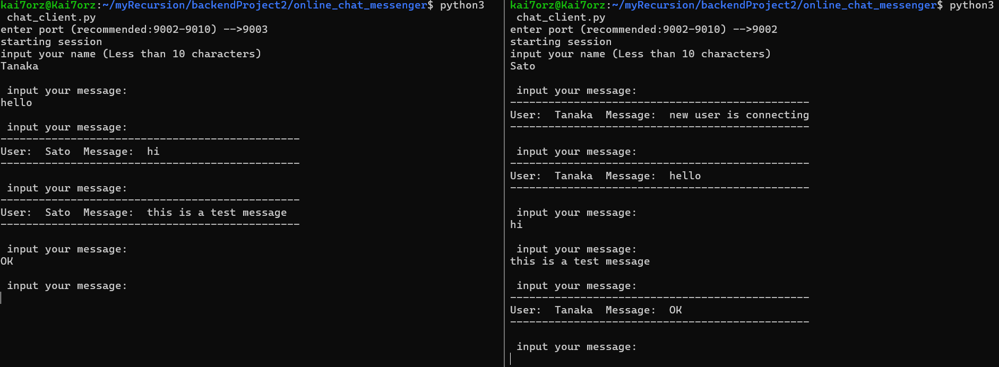
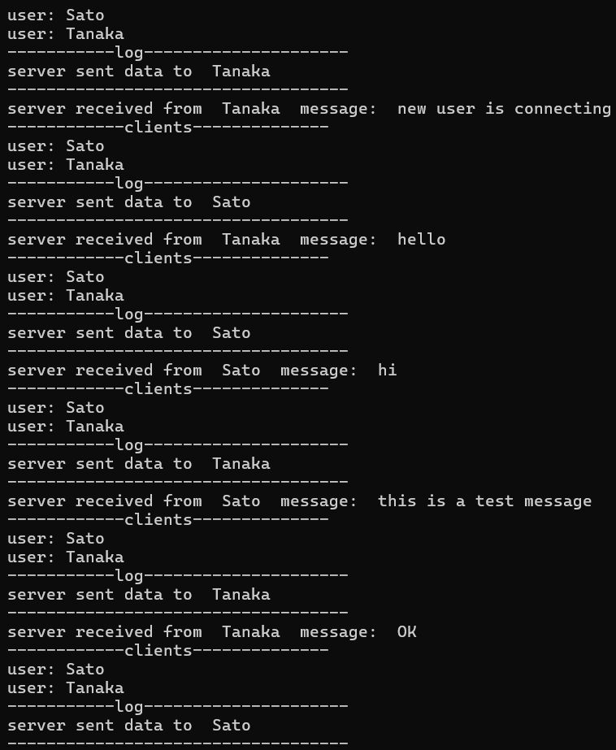

# online-chat-messenger(stage1)

## 概要
サーバーに接続したすべてのユーザーに対してメッセージの送受信を行うシステム.


## 実行方法
サーバー側
```
python3 chat_server.py
```
### クライアント側
クライアント側
```
python3 chat_client.py
```

## 流れ
1.クライアントがバインドするポート番号を入力<br>
2.ユーザー名の入力(9文字以下の制限あり)<br>
3.任意のメッセージを送信(4096-ユーザー名文字数(英字)-1 以下の文字数制限)<br>
メッセージが接続されている全クライアントに対して送信される.100秒以上メッセージを送信していないユーザーはサーバーの接続クライアントから除外されることに注意.

## 実際の動作(写真)

システムの開始<br>


<br>
実際のチャットの様子
<br>


<br>
チャット中のサーバーの様子
<br>



